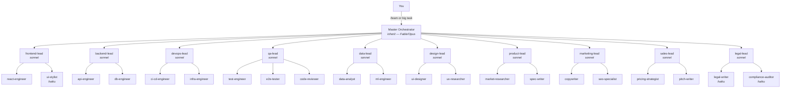

# Claude Team — Architecture

## Org chart



Specialists are `sonnet` unless marked.

## How a task flows

1. **You** invoke `/team` (or Claude auto-delegates from agent descriptions).
2. **Master Orchestrator** (your main session, or the `master-orchestrator` agent for background runs) triages: trivial → done directly; single-team → one lead; cross-functional → full protocol.
3. **Context bootstrap happens once** — graphify query or Explore agent → a compact Context Brief reused in every delegation.
4. **Leads** receive work packages with acceptance criteria and either delegate to their specialists or execute directly.
5. **Retro loop**: QA/lead checks results against acceptance criteria with evidence; REVISE feedback goes back to the *same* agent (SendMessage) up to 3 times.
6. **Synthesis**: one honest report to you — what shipped, evidence, decisions, risks.

## The nesting caveat (important)

Claude Code does not always allow a subagent to spawn its own subagents. The org degrades gracefully:

- **Nesting available** → leads spawn their specialists directly (true 3-level hierarchy).
- **Nesting unavailable** → leads return a *delegation plan*; the Master Orchestrator spawns the specialists itself and routes results back to the lead for review via SendMessage.

Every lead's prompt handles both cases, so the same repo works across environments and Claude Code versions.

## Design principles

- **Judgment up, typing down.** The expensive model decides and reviews; cheap models execute well-specified work.
- **Briefs, not dumps.** Agents exchange compact structured briefs (objective, context pointers, constraints, acceptance criteria, output contract) — never raw file contents.
- **Evidence or it didn't happen.** Every "done" ships with command output, screenshots, or diffs. QA judges evidence, not claims.
- **Bounded loops.** Max 3 revision cycles per package, then escalate to the human. Infinite retry is a token furnace.
- **Right-sized orgs.** Triage exists precisely so a typo fix never convenes nine leads.

## Repo layout

```
ClaudeTeam/
├── .claude/
│   ├── agents/claude-team/      # 32 agents, grouped by team
│   │   ├── master-orchestrator.md
│   │   ├── engineering/  design/  product/  marketing/  sales/  legal/
│   └── skills/
│       ├── team/SKILL.md        # /team — the orchestration protocol
│       ├── retro/SKILL.md       # /retro — learn & patch the org
│       └── hire/SKILL.md        # /hire — add agents in house format
├── docs/                        # this file, MODEL-STRATEGY, INTEGRATIONS
├── install.sh                   # symlink/copy into a project or user-level
└── README.md
```
